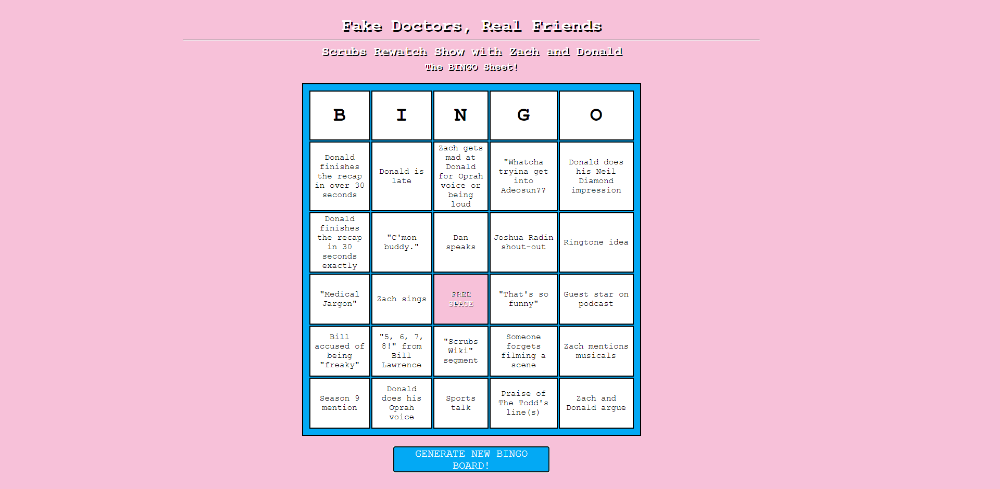

## [Fake Doctors, Real Friends BINGO](https://zace118.github.io/fdrf_bingo/)

Anyone that knows me well knows how much I love the cult-classic medical comedy TV show Scrubs. It's literally MY FAVORITE SHOW EVER.

You might also know that there is a Scrubs rewatch podcast happening right now called "Fake Doctors, Real Friends". In the 25-ish episodes they've done, the fans made a BINGO game out of common phrases and things the hosts (Zach Braff and Donald Faison) do and say.

I created this to generate a unique BINGO board that allows you to play the game while listening to the podcast.

## Future Iterations

I am thinking about creating a way to log in and then only allowing users to generate two boards a week (one per episode, episodes are released Tuesdays and Thursdays). I was also thinking about incorporating the iHeart Radio API so I could add a player on the my site so you can listen to the episode and play BINGO on the same page.

## Listen to the podcast [here!](https://www.iheart.com/podcast/1119-fake-doctors-real-friends-60367049/)
